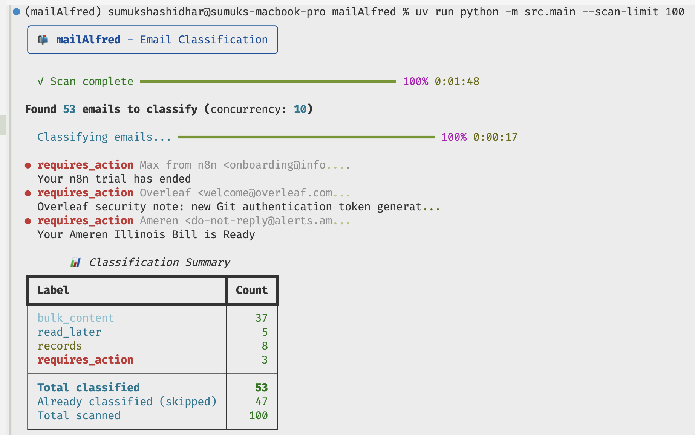

# mailAlfred Documentation

Welcome to the mailAlfred docs. This guide is organized for quick setup and deeper system understanding, with a focus on extensibility.

<picture>
  <source media="(prefers-color-scheme: dark)" srcset="assets/preview_image_dark.png">
  <source media="(prefers-color-scheme: light)" srcset="assets/preview_image_light.png">
  
</picture>

## Start Here

- `getting-started.md` - Install, configure, and run in minutes
- `gmail-setup.md` - Gmail OAuth and API setup
- `llm-setup.md` - OpenAI-compatible model configuration

## Reference

- `cli-reference.md` - Command-line options and examples
- `labels.md` - Classification labels and taxonomy guidance

## Architecture

- `architecture.md` - System design, data flow, and extension points
- `extending.md` - How to add connectors, labels, and model adapters

## Help

- `troubleshooting.md` - Common issues and fixes
- `contributing.md` - Development workflow and conventions
